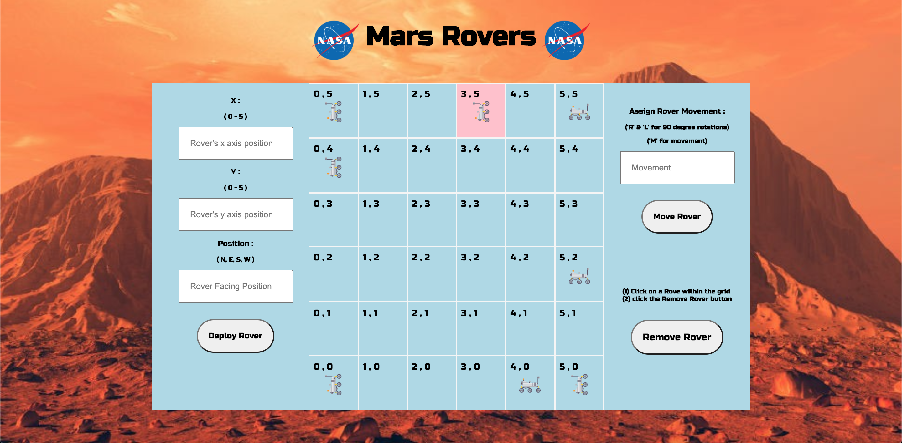

# Mars Rovers



## Overview
A squad of robotic rovers are to be landed by NASA on a plateau on Mars.

This plateau, which is curiously rectangular, must be navigated by the rovers so that their on board cameras can get a complete view of the surrounding terrain to send back to Earth.

A rover's position is represented by a combination of an x and y co-ordinates and a letter representing one of the four cardinal compass points.

The plateau is divided up into a grid to simplify navigation. An example position might be 0, 0, N, which means the rover is in the bottom left
corner and facing North.

In order to control a rover, NASA sends a simple string of letters. The possible letters are 'L', 'R' and 'M'. 'L' and 'R' makes the rover spin 90
degrees left or right respectively, without moving from its current spot.

'M' means move forward one grid point, and maintain the same heading.
Assume that the square directly North from (x, y) is (x, y+1).

## Deployment
The app is deployed on ...

## Built With
* React
* Node.js
* Express
* MongoDB
* Sass
* Axios
* Git
* Github

## Getting Started
To download the source code click the clone button. Run the following commands in the terminal:

* To install all packages listed in the package.json:
```terminal
npm i
```

* To run the app in your localhost:
* In the root folder run the command, to run both back and frontend simultaneously:
```terminal
npm run dev
```

# Backend:

I began by building the backend first. I set up the routes, controllers, middleware, errorhandlers, models, database and tested the requests using Insomnia.

### All backend requests:


## created directories: 
* config -> config.env & routes.js
* controllers -> rovers.js
* db -> connect.js
* lib -> errorHandler.js & errorMessages.js
* middleware -> async.js & errorResponse.js
* models -> rover.js & rovermovement.js
* index.js
* frontend -> create reactapp

## config.env

### Created MongoDB Atlas Database 

Stores database in the cloud.

Used URL given by Atlas and set it to variable, also storing the port here.

```javascript 
DB_CONNECT = mongodb+srv://<username>:<password>@cluster0.blzrd.mongodb.net/roverdb?retryWrites=true&w=majority

PORT = 8000
```

## async.js
```javascript
* const asyncHandler = (fn) => (req, res, next) => Promise.resolve(fn(req, res, next)).catch(next)

module.exports = asyncHandler
````

This is middleware that will wrap around a function. The function is expected to receive a req, res and next parameters.

The middleware is essentially a try catch (promise.resolve()).

If there is any error within the Promise.resolve() it will catch the error with Catch(next) and move it next.

Next() meaning passing it on to the errorHandler which will catch and handle the error.

## errorResponse.js
```javascript
class ErrorResponse extends Error {
  constructor(message, statusCode){
    super(message)
    this.statusCode = statusCode
  }
}

module.exports = ErrorResponse
````

This class builds error messages and status codes. This is done by building an object which extends the Error class and passes two arguments; message and statusCode.

## index.js
```javascript
dotenv.config({ path: './config/config.env' })
connectDB() 
````
Calling connection here. ConnectDB comes after dotenv as I am calling process.env within the connectDB function.

```javasscript
const PORT = process.env.PORT || 8000
````
This is a fallback incase the process.env file doesn't work.

```javascript
const server = app.listen(PORT, () => console.log(`Express is listening on port ${PORT}`))
```
```javascript
process.on('unhandledRejection', (err, promise) => {
  console.log(`err: ${err.message}`)
  server.close(() => process.exit(1))
})
```
An example of an unhandled promise rejections: (node:44800) [DEP0018] DeprecationWarning: Unhandled promise rejections are deprecated.

The unhandled promise rejections cause the server to "hang". Using process.exit allows us to put an end to it/kill the server.


## rover.js (models directory)
```javascript
const mongoose = require('mongoose')

const roverSchema = new mongoose.Schema({
  x: { type: Number, required: true },
  y: { type: Number, required: true },
  position: { type: String, required: true, enum: ['N', 'E', 'S', 'W'] } 
}, {
  timestamps: true
})

module.exports = mongoose.model('Rover', roverSchema)
```
This roverSchema includes the x and y positions that will be returned as numbers and are required. It also includes the position which the rover wil face using enum to check for 'N', 'E', 'S' and 'W'.

## roverMovement.js (models directory)
```javascript
const mongoose = require('mongoose')

const roverMovementSchema = new mongoose.Schema({
  movement: { type: String, required: true, enum: ['r', 'R', 'l', 'L', 'm', 'M'] } 
}, {
  timestamps: true
})

module.exports = mongoose.model('RoverMovement', roverMovementSchema)
```
The roverMovementSchema includes only a movement key which will accept the strings included in the enum. I included both lower and upper case so that the enum will be case insensitive.
'R' & 'L' = 90 degree rotation in the same spot. 'M' = movement.


## createRover function in controllers directory
```javascript
const roversCreate = asyncHandler(async(req, res, next) =>  {
  //* checking to see if req.body contains positions x & y & position or if it is undefined
  if (!req.body.x || req.body.x === undefined) {
    return next(new ErrorResponse('missing position x', 400))
  }
  if (!req.body.y || req.body.y === undefined) {
    return next(new ErrorResponse('missing position y', 400))
  }
  if (!req.body.position || req.body.position === undefined) {
    return next(new ErrorResponse('missing rover facing position', 400))
  } 

  const newRover = {
    //* turning x and y into ints and turning position to upperCase
    x: parseInt(req.body.x),
    y: parseInt(req.body.y),
    position: req.body.position.toUpperCase() 
  }

  const createdRover = await Rover.create(newRover) 

  //* INVALID IF COORDINATES ARE OUTSIDE OF THE 5*5 GRID 
  if (req.body.x > 5 || req.body.x < 0) {
    return next(new ErrorResponse('Outside of grid parameters', 400))
  }
  if (req.body.y > 5 || req.body.y < 0) {
    return next(new ErrorResponse('Outside of grid parameters', 400))
  }

  res.status(201).json(createdRover)
  
})
```

## moveRover function in controllers directory
```javascript
const roversMovement = asyncHandler(async(req, res, next) => {
  if (!req.body.id || !req.body.movement) {
    return next(new ErrorResponse('missing movement assignement or Rover ID', 400))
  }
  const roverId = req.body.id 
  
  // * find the rover to be moved
  const rover = await Rover.findById(roverId)
  if (!rover){
    return next(new ErrorResponse(notFound, 404))
  }

  //* turns the movement string to uppercase then splits the movement string that is inputed into an array
  const moveRoverCommandsArray = req.body.movement.toUpperCase().split('') 

  const movementsArray = []

  //* this will be a copy of the rover model at this stage. This will be updated with every movement assigned to the rover.
  const roverInMotion = { 
    x: rover.x, 
    y: rover.y, 
    position: rover.position 
  }

  //* object which contains movement possibilities
  //* adding the function to M: to receive current position and manipulate it according to the movement input
  const movementOptions = {
    N: { L: 'W', R: 'E', 
      M: function(rover){
        return rover.y++
      } },
    E: { L: 'N', R: 'S',
      M: function(rover){
        return rover.x++
      } },
    S: { L: 'E', R: 'W', 
      M: function(rover){
        return rover.y--
      }  },
    W: { L: 'S', R: 'N',
      M: function(rover){
        return rover.x--
      } } 
  }

  //* Mapping through the movement commands within the array. 
  moveRoverCommandsArray.map((movement) => {
    if (movement === 'L' || movement === 'R') { 
      //* 'L' & 'R' are only 90 degree angle roataions
      //* Updating rover's current position through the movementOptions 
      roverInMotion.position = movementOptions[`${roverInMotion.position}`][`${movement}`]
    } else if (movement === 'M') {
      //* The rover will be updated with every movement assigned to the rover
      movementOptions[`${roverInMotion.position}`].M(roverInMotion)
    }
    //* pushing the new movement assignment into movementsArray
    movementsArray.push({ x: roverInMotion.x, y: roverInMotion.y, position: roverInMotion.position })
  })
  //* newPosition: roverInmotion = returning the end position once the movements have been completed
  //* movementsArray: movementsArray = returning an array of all of the movement positions 
  res.status(200).json({ newPosition: roverInMotion, movementsArray: movementsArray }) 
})
```

# Frontend:

As the name would suggest Main.js contains the "main" content of the app. 

```javascript
 const [gridState, setGridState] = useState([])
  const [roversState, setRoversState] = useState([])
  const [isLoading, setIsLoading] = useState(true)
  const [clickedRoverId, setClickedRoverId] = useState({})

  useEffect(() => {
    const gridWidth = 6
    const gridHeight = 6
    let grid = []


    //* creating a 2 dimentional grid. x and y. 
    //* creating arrays within an array. The first array represents the y axis and the arrays nested within represent the x axis.
    for (let i = 0; i < gridHeight; i++) {
      //* This loop will create the number of rows representing the y axis as arrays. This will loop 6 times as stated in gridsHeight. 
      grid.push([])
      for (let ii = 0; ii < gridWidth; ii++) {
        grid[i].push({
          //* i represents the first loop which creates the y axis array. ii represents the second loop which creates the x axis arrays
          x: ii, y: i, active: false //! ref: highlight
        })
      }
    }

    //* reversing the order of the cells so that the bottom left corner will start at 0,0
    //* setting the reversed cells to state
    setGridState(grid.reverse())
  }, [])
```

This first useEffect is used to create the 2 dimentional grid with x and y. The first array represents the y axis and the arrays nested within represent the x axis.

The loop creates the number of rows representing the y axis as array. This loop will run 6 times as stated in gridHeight.

i represents the first loop which creates the y axis array. ii represents the second loop which creates the x axis arrays.

active: false will be later referred to when creating the highlight on the grid space where a rover is clicked.

The grid is set to state and reversed so that the bottom left will start with x = 0 and y = 0.

```javascript
useEffect(() => {
    const fetchRovers = async () => {
      try {
        const res = await getAllRovers()
        let rovers = []
        //* mapping through array of rovers, and pushing the roverId, currentPosition and the empty roverMovements into the rovers array
        res.data.map(rover => {
          rovers.push({
            roverId: rover._id,
            currentPosition: {
              x: rover.x,
              y: rover.y,
              position: rover.position
            },
            roverMovements: []
          })
          setRoversState(rovers) //* setting the rovers array to state
        })

        setIsLoading(false) //! Now that the grid is ready and the fetch of the rovers is completed and are set to state with setRoversState
      } catch (err) {
        console.log(err)
      }
    }
    //* if gridstate's length is larger than 1 then call fetchRovers function
    if (gridState.length > 1) {
      fetchRovers()
    }
  }, [gridState]) //* now every time gridState changes the function will run again
```
This second useEffect is used to fetch all the rovers.

I set the variable res to getAllRovers which sends a request to the backend and returns an array of all rovers. 

I then mapped through the array of rovers using res.data.map and pushed the roverId, current position and roverMovement as an object into the rovers array.
I Also included an empty roverMovements array which will be used later. The rovers array is then set to state.

The if statement is asking if the gridState's length is greater than one is true. If it is then call the fetchRovers function. I added gridState into the useEffect's dependency array so that every time gridState changes the function will run again.


```javascript
  //* aquiring the rover id on click
  const handleClick = (e) => {
    const clickedRover = {
      roverId: e.target.getAttribute('rover_id'),
      x: e.target.getAttribute('cell_x'),
      y: e.target.getAttribute('cell_y'),
    }
    setClickedRoverId(clickedRover)
  }
```

This handleClick function is listening to the event.target. The event.target are then sored in the variable clickedRover and set to state with setClickedRoverId

```javascript
const handleRoverMovement = (movementData) => {
    let roversCopyArray = [...roversState] //* spreading to scoop out the data in roversState and making an immutable copy array
    //* mapping over roversCopyArray to check if the roverId matches the movementData.roverId -> if false return same rover, if true update the rover in it's new position
    roversCopyArray = roversCopyArray.map(rover => {
      if (rover.roverId === movementData.roverId) {
        //* returning a new rover object for the roversCopyArray containing the rover's new position
        return {
          roverId: movementData.roverId,
          currentPosition: {
            x: movementData.newPosition.x,
            y: movementData.newPosition.y,
            position: movementData.newPosition.position
          },
          roverMovements: movementData.movementsArray
        }
      } else {
        //* return existing rover in it's current position
        return rover
      }
    })
    setRoversState(roversCopyArray) //* updating the rover's state through setting the roversCopyArray to state
    //! REF: updating the clickedRoverId state in order for the cell highlighted (where the rover has been clicked) in the GridRow compoenent to update
    setClickedRoverId({ 
      roverId: movementData.roverId,
      x: movementData.newPosition.x,
      y: movementData.newPosition.y
    })
  }
  ```

Passing movementData as a param in this handleRoverMovement function. 
I spread roversState to scoop out the date and created an immutable copy array assigned to the roversCopyArray variable.
I then mapped over roversCopyArray to check if the roverId matches the movementData.roverId. If it does not then the function will return the same rover in it's current position. If it is true then the rover will be updated in it's new position.
If the if statement is true then a new rover object for the roversCopArray containing the rover's new positon is returned. 

The rover's state is updated through setting roversCopyArray to state

Also updating the clickedRoverId state in order for the cell highlighted (where the rover has been clicked) in the GridRow component to update.

```javascript

  return (
...
        <RoverNew />
        {!isLoading ?
          <div className='grid-wrapper'>
            {gridState.map((cells, i) => {
              return <GridRow key={i} cells={cells} rovers={roversState} handleClick={handleClick} clickedRover={clickedRoverId} />
            })}
          </div>
          : null}
        <RoverNewMovement roverId={clickedRoverId.roverId} handleMove={handleRoverMovement} />
      </div>
    </div>

  )
```

* Passing roversState (array) as prop to GridRow
* Now it's certain that all of the rovers have been fetched from the database and are stored in the state, together with the grid. Now the grid and the rovers can be printed
* Line 123: here I mapped gridState and I am calling the GridRow component. 
* Passed individual array of cells to each row as prop through cells + roversState as rovers + clickedRoverId as clickedRover
* Passed handleRoverMovement function as a reference in handleMove prop to the RoverNewMovement

```javascript
const GridRow = (props) => {
  const { cells, rovers, handleClick, clickedRover } = props

  let mainContent = (
    <div className="grid-cell-row">
      {
        cells.map((cell, i) => {
          let roverObj //* will be undefined unless the if statement below is true
          rovers.map((rover) => {
            if (rover.currentPosition.x === cell.x && rover.currentPosition.y === cell.y) {
              roverObj = {
                roverId: rover.roverId,
                currentPosition: rover.currentPosition
              }
            }
          })
          return <GridCell key={i} cell={cell} rover={roverObj} handleClick={handleClick} isClicked={parseInt(clickedRover.x) === cell.x && parseInt(clickedRover.y) === cell.y}
          />
        })
      }
    </div>
  )

  return (
    <div>
      {mainContent}
    </div>
  )
}
```
* In this component I am used props to map over cells array to get the cell object. I then mapped throw the rovers array to get the rover object.
* Then I compared the x and y keys in the rover and cell object to see if they match.  
* A rover will then be created in the GridCell component each time rovers.map finds a match 
* If they do then at new roverObj is created and passed as props to the GridCell component
* Inside GridRow component -> by returning mainContent I am also returned the GridCell compoenent. 
* Returbed GridCell 6 times as a result of cells.map

```javascript
onst GridCell = (props) => {
  const { cell, rover, handleClick, isClicked } = props

  //* assigning the correlating image position depending on the rover's movement assignement
  let roverImgPos
  if (rover !== undefined) {
    if (rover.currentPosition.position === 'E') {
      roverImgPos = roverE
    } else if (rover.currentPosition.position === 'N') {
      roverImgPos = roverN
    } else if (rover.currentPosition.position === 'S') {
      roverImgPos = roverS
    } else if (rover.currentPosition.position === 'W') {
      roverImgPos = roverW
    }
  }

  return (
    <div className={`grid-cell-item ${isClicked ? 'active' : ''}`}>
      <div className="cell-wrapper">
        <div className="cell-id">
          {`${cell.x} , ${cell.y}`}
        </div>
        <div className="box-root">
          {rover !== undefined ?
            <div className="rover-wrapper">
               handleClick(e)} />
            </div> : null}
        </div>
      </div>
    </div>
  )
```

* In continuation to GridRow. The rover = roverObj
* Using a ternary in the return, if the rover is not undefined it is printed
* The return in the onClick will send e.target to the handleClick function that was passed down through props from Main

## Wins
* Using MongoDB Atlas for the firs time
* Responsive design
* Working with React Hooks

## Challenges
* Having all rovers appear on grid
* Rover movement logic
* Logic for grid

## Future Improvements

* Make grid's size adjustable
* Fine-tune error messaging
* Rover movement animation
* Fine-tune styling 

## Key Learnings

Using MondoDB Atlas for the first time to store my database in the cloud was great. I had also explored different error handling methods with asyncHandler, learnt about window.location.reload(), further pratcice with React Hooks and worked through some challenging and complicated logic. 